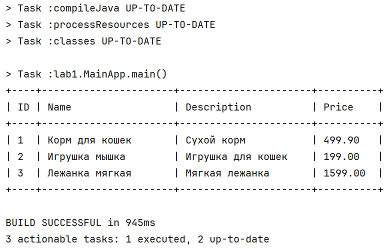

# Отчет о лаботаротоной работе 1. Gradle. Базовое приложение Spring
## Цель работы
Cоздать каркас приложения и разобраться с конфигурированием Spring приложений на основе Java-классов. Написать загрузчик CSV файлов.
## Выполнение работы

## Выводы
В ходе лобораторной работы создал каркас приложения и разобрался с конфигурированием Spring приложений на основе Java-классов. Написал загрузчик CSV файлов.