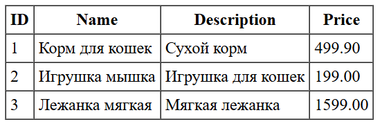

# Отчет о лаботаротоной работе 2. Конфигурирование приложение Spring c помощью аннотаций. Применение AOП для логирования

## Цель работы
Перейти на новое, более простое конфигурирование приложения с помощью аннотаций, добавить функционал по представлению таблиц в виде HTML и измерить скорость выполнения нашего кода c помощью инструментов АОП.
## Выполнение работы

## Выводы
В ходе лабораторной работы перешел на новое, более простое конфигурирование приложения с помощью аннотаций, добавил функционал по представлению таблиц в виде HTML и измерил скорость выполнения нашего кода c помощью инструментов АОП.