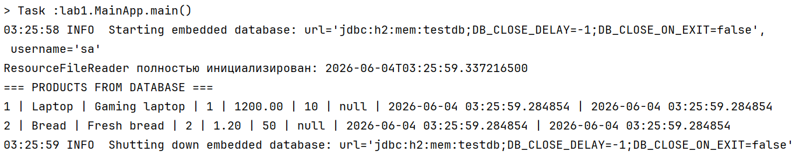

# Отчет о лаботаротоной работе 3. Технологии работы с базами данных.JDBC

## Цель работы
Научиться сохранять данные в базе данных. А также научиться выполнять SQL запросы и выводить их результаты в логи.
## Выполнение работы

## Выводы
В ходе лабораторной работы научился сохранять данные в базе данных. А также научился выполнять SQL запросы и выводить их результаты в логи.