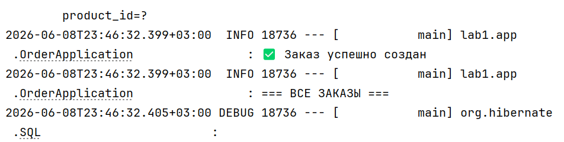

# Отчет о лаботаротоной работе 3. Технологии работы с базами данных. JPA. Spring Data

## Цель работы
Перейти с использования Spring JDBC на использование ORM Hibernate и Spring Data. Расширить приложение новыми сущностями и привел структуру приложения в соответствие со "слоистой архитектурой".
## Выполнение работы

## Выводы
В ходе лабораторной работы перешел с использования Spring JDBC на использование ORM Hibernate и Spring Data. Расширил приложение новыми сущностями и привел структуру приложения в соответствие со "слоистой архитектурой".